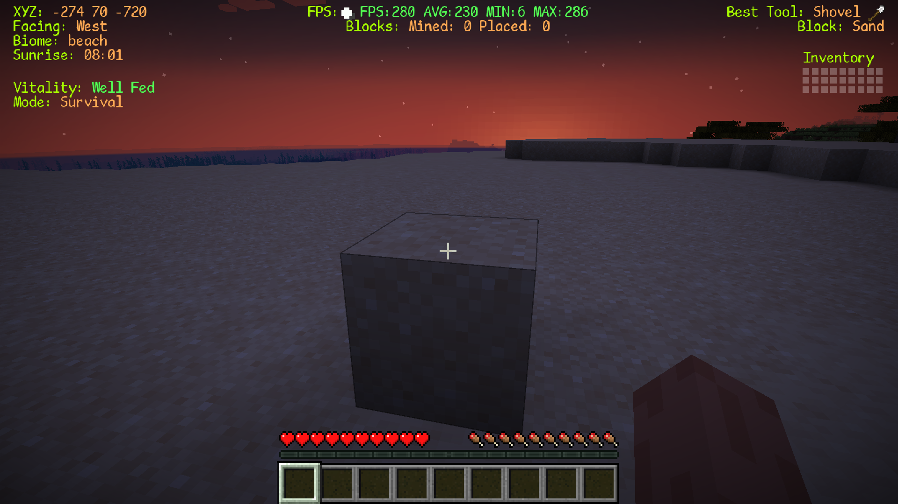
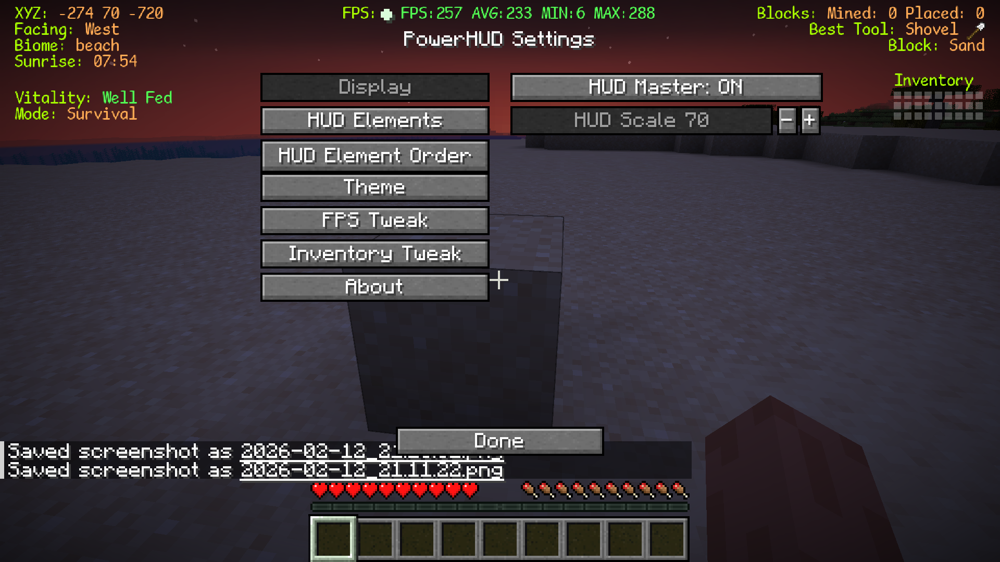
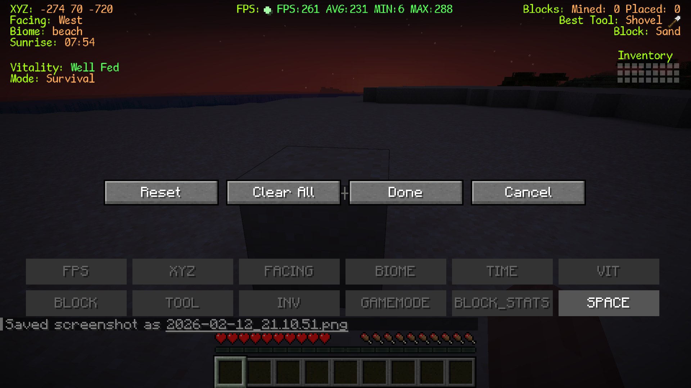
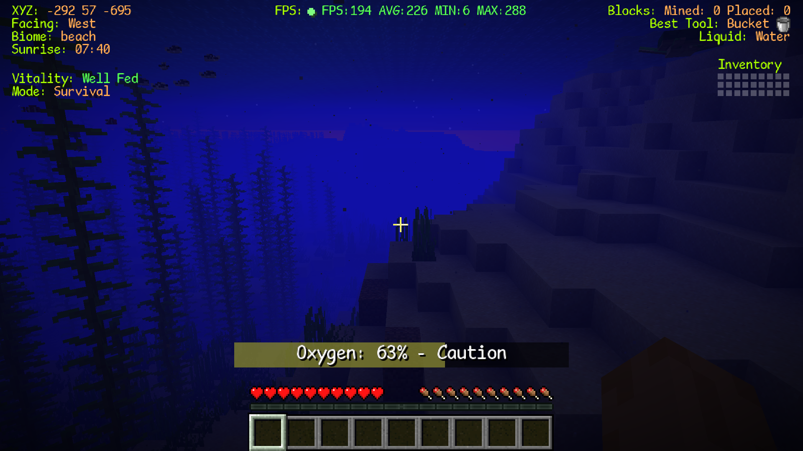
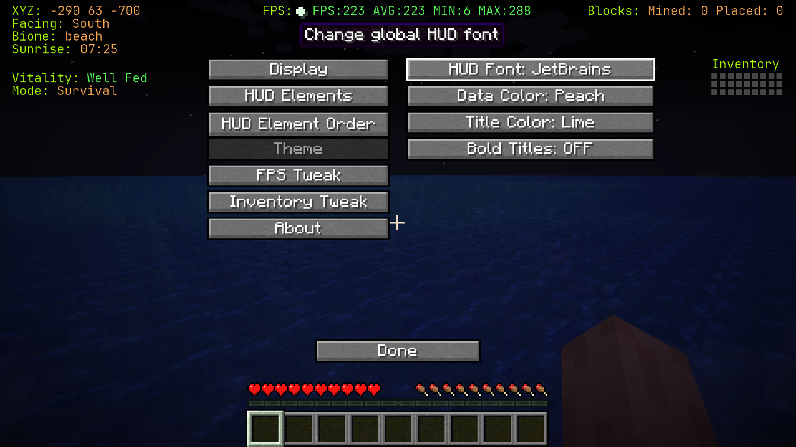

# PowerHUD

A modern, highly customizable HUD overlay mod for Minecraft Fabric 1.21.4

## ✨ Features

### 📊 Performance & Diagnostics
- **Real-time FPS Display** with color-coded performance indicators
- **Animated FPS Dot** that pulses based on performance
- **Min/Max/Average FPS Tracking** with reset capability
- **Custom F3 Debug Screen** - Cleaner, tabbed debug interface

### 🗺️ Navigation & World Info
- **Coordinates Display** (XYZ) with block position
- **Facing Direction** with cardinal directions
- **Biome Information** - See current biome name
- **Time Display** - In-game time with day/night indicator
- **Gamemode Indicator** - Current game mode display

### 🎒 Inventory & Equipment
- **Visual Inventory Display** - Grid-based inventory visualization
- **Best Tool Suggestions** - Shows optimal tool for target block
- **Block Information** - Displays block you're looking at
- **Block Statistics** - Track blocks mined/placed

### 🌊 Survival Stats
- **Oxygen Level Indicator** - Visual oxygen bar for underwater exploration
- **Vitality Display** - Health and status information

### 🎨 Customization

## 🎮 Default Keybindings
| Key | Action |
|-----|--------|
| \O\ | Open configuration screen |
| \H\ | Toggle HUD visibility |
| \R\ | Reset FPS statistics |
| \Z\ | Cycle debug screen modes |
## 📦 Installation

### Requirements
- Minecraft **1.21.4**
- [Fabric Loader](https://fabricmc.net/use/) (latest version)
- [Fabric API](https://modrinth.com/mod/fabric-api) (required dependency)

### Steps
1. Install Fabric Loader for Minecraft 1.21.4
2. Download Fabric API and place in your \.minecraft/mods\ folder
3. Download the latest PowerHUD release from [Releases](https://github.com/alienex-bit/PowerHUD/releases)
4. Place \powerhud-vX.X.X.jar\ in your \.minecraft/mods\ folder
5. Launch Minecraft with the Fabric profile

## ⚙️ Configuration

Press \O\ in-game to open the configuration screen.

### Available Options
- **Toggle Elements** - Show/hide individual HUD components
- **Font Selection** - Choose from 9 custom monospace fonts
- **Color Customization** - Select from 20+ colors for text and data
- **Bold Titles** - Toggle bold formatting for element titles
- **HUD Workbench** - Visual drag-and-drop editor with:
  - Live HUD preview
  - Zone-based snapping (left, center, right)
  - Spacer elements for flexible layouts
  - Auto-stacking with precise hitbox alignment
- **Scaling** - Adjust HUD size from 50% to 250%
- **FPS Tweaks** - Configure display mode (Minimal/Normal/Full), thresholds, and animated dot indicator
- **Inventory Tweaks** - Choose display style (Grid/Percent/Fraction)
- **Oxygen Settings** - Adjust centered overlay position with color-coded bar and toggle vanilla air bubbles
- **HUD Profiles** – Save/load/rename/delete/export/import HUD layouts. Save button is always enabled; enter a name to create/overwrite, leave blank to save to current. Profile names are validated for allowed characters and length.

### Export/Import Profiles

- **Export Profile:** Click Export to save the current profile as a .json file in your home folder.
- **Import Profile:** Place a .json file named import_profile.json in your home folder and click Import to add it to your profiles.

## 🖼️ Screenshots

### HUD in Action
<a href="screenshots/hud-overview.png" target="_blank">
  
</a>
*Main HUD display showing FPS, coordinates, and other elements*

### Configuration Screen
<a href="screenshots/config-screen.png" target="_blank">
  
</a>
*PowerHUD configuration interface*

### HUD Workbench
<a href="screenshots/hud-workbench.png" target="_blank">
  
</a>
*Visual drag-and-drop editor for arranging HUD elements*

### Oxygen Overlay
<a href="screenshots/oxygen-overlay.png" target="_blank">
  
</a>
*Centered oxygen bar with color-coded states*

### Custom Fonts & Colors
<a href="screenshots/fonts-colors.png" target="_blank">
  
</a>
*Examples of different fonts and color themes*

*More screenshots coming soon!*

## 🛠️ Building from Source

### Prerequisites
- Java 21 or higher
- Git

### Build Steps
```bash
# Clone the repository
git clone https://github.com/alienex-bit/PowerHUD.git
cd PowerHUD

# Build the mod (Windows)
gradlew.bat build

# Build the mod (Linux/Mac)
./gradlew build
```

The compiled JAR will be located in \build/libs\

### Development Environment
```bash
# Run Minecraft client with mod loaded
gradlew.bat runClient
```

## 📋 Roadmap

HUD stuff under consideration include:
- HUD Profiles (save/load configurations)
- Animated transitions and effects
- Historical data visualization (FPS graphs)
- Light level display
- Durability warnings
- Session statistics
- And much more!

## 🤝 Contributing

Contributions are welcome! Here's how you can help:

1. **Report Bugs** - [Open an issue](https://github.com/alienex-bit/PowerHUD/issues/new) with details
2. **Suggest Features** - Share your ideas in the issues section
3. **Submit Pull Requests** - Fork, code, and PR!

### Development Guidelines
- Follow existing code style
- Test thoroughly before submitting
- Update documentation for new features

## 📄 License

This project is licensed under the MIT License - see the [LICENSE](LICENSE) file for details.

## 🐛 Bug Reports & Support

Found a bug or need help?
- [Open an issue](https://github.com/alienex-bit/PowerHUD/issues/new)
- Provide Minecraft version, Fabric Loader version, and steps to reproduce


## 📊 Version History

- **v1.13.0** – (February 13, 2026)
  - **NEW: Accessibility color presets are now stored per profile**
  - **CHANGED: 'Default' color preset renamed to 'Off'**
  - **Manual color selection is only available when 'Off' is selected**
  - **All accessibility presets enforce dark background and bold data**
  - **README and version.txt updated to reflect these changes**

- **v1.12.0** – (February 13, 2026)
  - **NEW: Complete profile management overhaul**
    - Save, rename, delete, export, and import profiles
    - Save button always enabled: blank = save to current, text = new/overwrite
    - Profile name validation (letters, numbers, -, _, max 32 chars)
    - Visual feedback for all actions
    - Tooltips for all profile actions
    - Keyboard shortcuts for save/cancel
    - Auto-focus on profile input
    - Improved workflow for profile save/restore
    - Export: saves profile as .json to your home folder
    - Import: loads import_profile.json from your home folder

- **v1.11.5** - Previous release (February 13, 2026)
  - **IMPROVED: Profile manager** now displays the currently loaded profile at the top
  - **IMPROVED: Profile list** has compact Load ("L") and Delete ("x") buttons for each profile
  - **NEW: Delete confirmation dialog** prevents accidental profile deletion
  - **UI fixes** for button sizing and layout

- **v1.11.4** - Previous release (February 12, 2026)
  - **NEW: HUD Profiles** - Save/load/delete HUD layouts for quick switching between custom setups. Instantly switch between different HUD configurations and layouts. Profiles are stored and can be restored at any time, making it easy to experiment or revert to a favorite layout.
  - **IMPROVED: Oxygen overlay UI** - Lighter opacity, always fixed width, improved text contrast
  - **IMPROVED: HUD Workbench** - Drag boxes align exactly with HUD bounds at any scale
  - **IMPROVED: Persistence** - Settings reliably save and restore
  - **FIXED: Vanilla air bubble hiding** - Now properly hides all air bubble states (full, bursting, empty) when toggle is off

- **v1.11.3** - Previous release (February 12, 2026)
  - Added HUD profile management (save/load/delete), improved oxygen overlay, UI fixes

- **v1.11.2** - Previous release (February 12, 2026)
  - FIXED: Vanilla air bubble hiding - Now properly hides all air bubble states (full, bursting, empty) when toggle is off

- **v1.11.1** - Previous release (February 12, 2026)
  - NEW: WYSIWYG HUD Workbench - Visual drag-and-drop editor with live preview
  - NEW: Zone-Based Snapping - Elements auto-snap to left, center, or right screen zones
  - NEW: Spacer Elements - Add flexible vertical spacing between elements
  - IMPROVED: Hitbox Alignment - Drag/hover boxes now align precisely with HUD text at any scale
  - FIXED: Critical NPE crash when opening HUD workbench
  - Auto-stacking elements in each zone with proper spacing
  - Elements shift automatically when dragged between positions
  - Version auto-displayed in About screen via Fabric metadata

- **v1.10.1** - Previous release
  - Refactored oxygen display to centered overlay with color-coded bars
  - Removed text effects (shimmer, chroma) for cleaner performance
  - Removed background styling and shadow features for simplified design
  - Expanded color palette to 20+ options
  - Improved FPS display modes (Minimal/Normal/Full)
  - Enhanced configuration screen

## 🙏 Acknowledgments

- Built with [Fabric](https://fabricmc.net/)
- Font resources from various open-source projects
- Inspired by the Minecraft modding community

---

**Made with ☕ by [alienex-bit](https://github.com/alienex-bit)**
